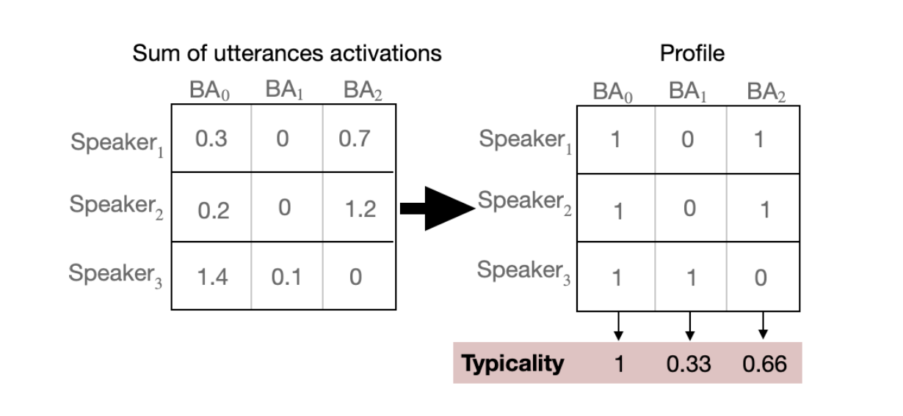

# Loss functions

The BA-LR toolkit provides some loss functions to use during [training of a Binary Attribute Encoder](./trainer.md).

## BaseAutoEncoderLoss

All loss functions which can be used with a `BinaryAttributeEncoderTrainer` must be subclasses of `BaseAutoEncoderLoss`.

```python
class BaseAutoEncoderLoss(torch.nn.Module, ABC):

    def __init__(self, name: str, weight: torch.Tensor | None = None, *args, **kwargs):
        super().__init__(*args, **kwargs)
        ...
```

A `BaseAutoEncoderLoss` function can have a `weight` parameter which will be applied to itself to compute the `total loss` during training (the `total loss` is the weighted sum of the losses computed by the loss functions of the trainer).

All `BaseAutoEncoderLoss` classes must implement the `forward` method which computes the loss from the parameters.

```python
def forward(
    self, input: torch.Tensor, labels: torch.Tensor, output: torch.Tensor, recon: torch.Tensor, Z: torch.Tensor,
) -> torch.Tensor:
```

**Parameters**:

* **input**: input features fed to the model (i.e. embeddings). A torch.Tensor of size (batch_size, embedding_dim).
* **labels**: labels associated to the input. A torch.Tensor of size (batch_size).
* **output**: model's encoded reprensentation of the input. A torch.Tensor of size (batch_size, encoder_dim).
* **recon**: the reconstructed input from the model. A torch.Tensor of size (batch_size, embedding_dim).
* **Z**: the model's latent space representation of the input. A torch.Tensor of size (batch_size, encoder_dim).

## MSE Loss

An implementation of [`torch.nn.MSELoss`](https://pytorch.org/docs/stable/generated/torch.nn.MSELoss.html).

## Triplet Margin Loss

```python
class TripletMarginLoss(BaseAutoEncoderLoss):

    def __init__(
        self, margin: float = 0.3, type_of_triplets: str = "all", weight: torch.Tensor | None = None,
    ):
```

**Parameters**:

* **margin**: the difference between the anchor-positive distance and the anchor-negative distance.
* **type_of_triplets**:
    * "all" selects all triplets that violate the margin
    * "hard" is a subset of "all", but the negative is closer to the anchor than the positive
    * "semihard" is a subset of "all", but the negative is further from the anchor than the positive
    * "easy" selects all triplets that **do not** violate the margin.

An implementation of [`Triplet Margin Loss`](https://kevinmusgrave.github.io/pytorch-metric-learning/losses/#tripletmarginloss). The `TripletMarginLoss` uses a [`Triplet Margin Miner`](https://kevinmusgrave.github.io/pytorch-metric-learning/miners/#tripletmarginminer) to compute all possible triplets within the batch based on the labels. Anchor-positive pairs are formed by embeddings that share the same label, and anchor-negative pairs are formed by embeddings that have different labels. The miner selects positive and negative pairs that are particularly difficult, i.e. all triplets that violate the `margin` param (the difference between the anchor-positive distance and the anchor-negative distance).

!!! note

    In order to be able to select triplets, each batch must contain **at least 2 distinct classes** (to form the anchor-negative pairs) and **at least 2 samples per class** (to form the anchor-positive pairs). Shuffling the classes grouped together in a batch is also recommended to avoid overfitting to some pairs.

## ArcFace Loss

```python
class ArcFaceLoss(BaseAutoEncoderLoss):

    def __init__(
        self, margin: float = 0.3, type_of_triplets: str = "all", weight: torch.Tensor | None = None,
    ):
        ...

    def setup(self, nb_train_classes: int, internal_dim: int):
```

**Parameters**:

* **margin**: the difference between the anchor-positive distance and the anchor-negative distance.
* **type_of_triplets**:
    * "all" selects all triplets that violate the margin
    * "hard" is a subset of "all", but the negative is closer to the anchor than the positive
    * "semihard" is a subset of "all", but the negative is further from the anchor than the positive
    * "easy" selects all triplets that **do not** violate the margin.
* **nb_train_classes**: the number of unique classes in the train dataset.
* **internal_dim**: the encoder's dimension.

An implementation of [`ArcFace Loss`](https://kevinmusgrave.github.io/pytorch-metric-learning/losses/#arcfaceloss). The `ArcFaceLoss` uses the same [`Triplet Margin Miner`](https://kevinmusgrave.github.io/pytorch-metric-learning/miners/#tripletmarginminer) as the `TripletMarginLoss` to select triplets.

The loss's `setup` method must be called once the trainer is instantiated to provide additionnal parameters. The trainer will call `setup` on each loss function with named parameters that can be used to setup the loss.

!!! note

    This loss's parameters must be passed to the optimizer during training.

## Sparsity Loss

The goal of the sparsity loss is to push the model to encode binary representations modeled by shared discriminant attributes between speakers. An attribute is considered present in the profile, if the sum of all utterance activations per attribute for a speaker is non-zero, while the typicality is the presence frequency of an attribute amon speaker profiles. So we can regulate the activations of the latent space dimensions before binarization to ensure that only a subset of speakers has a particular dimension present in their profile.

<figure markdown="span">
  { width="400" }
  <!-- <figcaption>Example illustrating the relationship between utterances activations and speaker profiles used to compute the typicality</figcaption> -->
</figure>

The sparsity loss drives the binary-attribute dimensions towards achievin a desired presence frequency among speakers. Mainly, to ensure the absence of an attribute in a speaker's profile, we need to drive the sum of activations across all their utterance vectors to 0. The sparsity loss pushes each dimension to follow a specific sparsity while
considering speakers.

<figure markdown="span">
  { width="800" }
  <!-- <figcaption>Sparsity loss computing for a batch during training</figcaption> -->
</figure>

!!! note

    The sparsity loss requires each batch to contain N speakers and M samples per speaker.

The sparsity loss works with the latent space representations of the speaker embeddings from the encoder (Tanh activations ranging from -1 to 1. `Z` in the figure above). The vector `V` representing the desired frequency presence of attributes is generated randomly when the loss is initialized.

```python
class SparsityLoss(BaseAutoEncoderLoss):

    def __init__(self, weight: torch.Tensor | None = None):
        ...

    def setup(self, M_samples_per_class: int, internal_dim: int):
```

The `SparsityLoss` class does not take parameters at initialization (other than its `weight`) but its `setup` method must be called once the trainer is instantiated. The trainer will call `setup` on each loss function with named parameters that can be used to setup the loss.

**Parameters**:

* **M_samples_per_class**: the number of samples per speaker in each batch.
* **internal_dim**: the encoder's dimension.


## CLI

The losses used during training can be set by overriding the `trainer.losses` parameter.

!!! example

    ```bash
    balr train resources/data/voxceleb2/train.csv resources/data/voxceleb2/test.csv 'trainer.losses=[mse, arcface]'
    ```

    will run training with two loss functions: MSE and ArcFace. The `total loss` during training will be the weighted sum of these two losses.

!!! example

    ```bash
    balr train resources/data/voxceleb2/train.csv resources/data/voxceleb2/test.csv 'trainer.losses=[mse, arcface]' trainer.losses.arcface.weight=1 trainer.losses.arcface.margin=0.5
    ```

    this example also modifies the parameters for the ArcFace loss, changing its weight and margin parameters.
